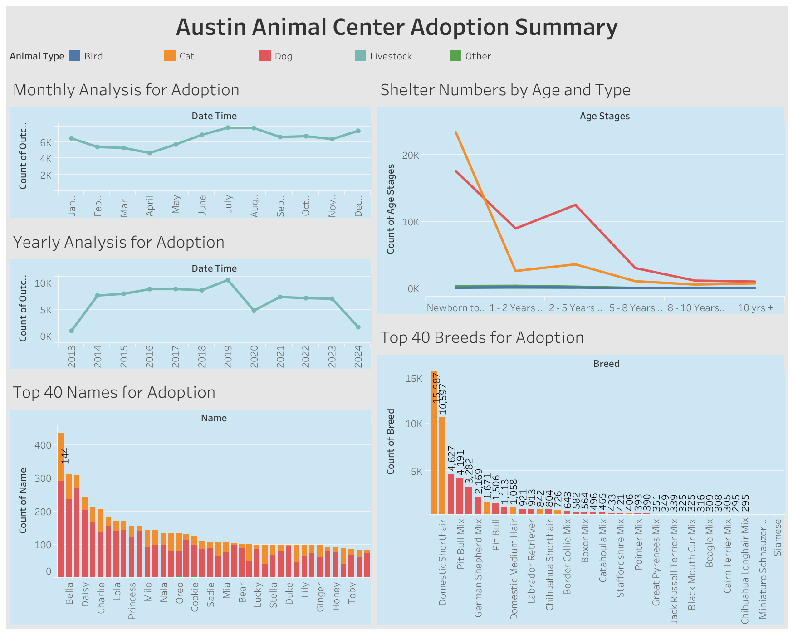

# Austin Animal Center Adoption Summary

## Table of contents
* [About](#about)
    * [Motivation](#motivation)
    * [What I Learned](#what-i-learned) 
* [Data Dashboard](#dashboard)
    * [Analysis Summary](#analysis-summary)
* [Dataset](#dataset)
* [Contact](#contact)

## About

I went to [City of Austin Open Data Portal](https://data.austintexas.gov) to look for a  local and relevant dataset to use. Animal Care was the first category, and knowing the no-kill policy at many shelters, I was interested in what traits and factors led to the adoption of these animals. Even though the dataset includes all outcome types, I have limited my analysis to focus on Adopted animals. 

You can view the final version of my [Data Dashboard](https://public.tableau.com/views/AnimalsinShelters/MostPopularChoicesforAdoptionbyNameAgeandBreed?:language=en-US&publish=yes&:sid=&:redirect=auth&:display_count=n&:origin=viz_share_link) here. I created this using Tableau Desktop 2024.1.

### Motivation
As an aspiring data scientist, I wanted to learn more about the industry standards for data analysis techniques. I have prior analysis experience using JavaScript and Excel/Sheets; however, companies heavily rely on programs such as Python, R, and Tableau to complete their analyses and dashboards. Doing these projects allows me to strengthen my skills in these programs while creating a presentable output. 

### What I Learned

* Design an interactive dashboard and publish it online,

* Connect to different data sources such as Excel and Google Sheets,

* Create a variety of charts including bar charts, line charts, donut charts, tables and dual-axis charts,

* Filter data using sets and groups,

* Tell a story through the narrative of the dataset, and

* Use dashboard actions to create custom, interactive dashboards.

## Data Dashboard

### Analysis Summary

I would like to summarize and highlight a few key points from this dataset and data analysis:
* **Age:** Though it may be obvious that younger dogs and cats are more likely to get adopted, newborn cats beat newborn dogs in adoption numbers. The adoption numbers for both animals drop after that first year, but dogs keep a fairly high number compared to cats overall.
* **Time:** There was a drop in adoptions during the pandemic in 2020. As for months, the most adoptions occur during the Summer months (June, July, August) and during the winter holidays (December, January). 
* **Breed:** Domestic Shorthair and their mixes are by far the cat type with the most adoptions from the center. For dogs, Labrador Retriever and Pitbull are the top two breeds for adoption; however, these numbers are only half of the adoption numbers for Domestic Shorthairs. 
* **Names:** Luna, Bella, and Max are the most popular names to be adopted from the Animal Center in total between cats and dogs. The first non-traditional human name is Rocky which is 6th, then comes Buddy at 9th, and Blue at 13th. 

## Dataset
Dataset was provided by [City of Austin Open Data Portal](https://data.austintexas.gov/Health-and-Community-Services/Austin-Animal-Center-Outcomes/9t4d-g238/about_data). 

This dataset contains 165,000 rows with 12 columns where each row is one outcome per animal per encounter. The 12 columns includes identifiable animal information such as Animal Name, Date of Outcome, Outcome Type, Animal Type, Animal Breed, Animal Age,  Animal Color, and etc. 

## Contact

Nanor Asadourian - nanor.asadourian@gmail.com
