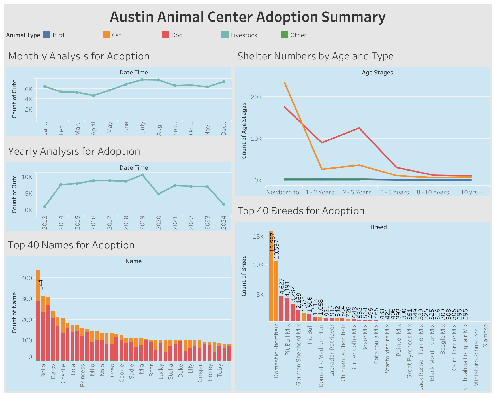

# Austin Animal Center Analysis

## Table of contents
* [About](#about)
    * [Motivation](#motivation)
    * [Key Takeaways](#key_takeaways)* 
* [Screenshots](#screenshots)
* [Contact](#contact)

## About

I created this project to learn some introductory topics about data science and data visualization. I created this using Tableau Desktop 2024.1.

You can view the final version of my [Data Dashboard](https://public.tableau.com/views/AnimalsinShelters/MostPopularChoicesforAdoptionbyNameAgeandBreed?:language=en-US&publish=yes&:sid=&:redirect=auth&:display_count=n&:origin=viz_share_link) here. 

### Motivation
As an aspiring data scientist, I wanted to learn more about the industry-standards for data analysis techniques. I have prior experience using JavaScript and Excel/Sheets; however, companies heavily rely on programs such as Python, R, and Tableau to complete their analyses and dashboards. 

I went to [City of Austin Open Data Portal](https://data.austintexas.gov) to look for a  local and relavent dataset to use. Animal Care was the first category, and I know many shelters around Austin are no-kill. I was interested in exactly how many animals passed through shelters or animal centers. 

### Key Takeaways

* Design an interactive dashboard and publish it online,

* Connect to different data sources such as Excel and Google Sheets,

* Create a variety of charts including bar charts, line charts, donut charts, tables and dual axis charts,

* Filter data using sets and groups,

* Tell a story through the narative of the dataset, and

* Use dashboard actions to create custom, interactive dashboards.

## Screenshots

## Dataset
Dataset was provided by [City of Austin Open Data Portal](https://data.austintexas.gov/Health-and-Community-Services/Austin-Animal-Center-Outcomes/9t4d-g238/about_data). 

This dataset contains 165,000 rows with 12 columns where each row is one outcome per animal per encounter. The 12 columns presented each outcomes Animal Name, Date of Outcome, Outcome Type, Animal Type, Animal Breed, Animal Age,  Animal Color, and etc.  

## Contact

Nanor Asadourian - nanor.asadourian@gmail.com
